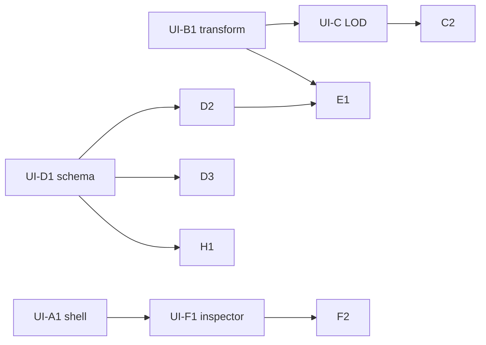

# Notes mind map — deep wireframe + UI task taxonomy (subagent-ready)

**North star:** One canvas holds **thousands** of items: notes, full conversations (per persona / model), imported `.md` threads, and **clusters** (floating groups). At a distance you see **dots + lines**; zoom in to read; click to open **full note or full convo** in the inspector. **Edges** show cross-reference and “they talked about each other.” **Topic filters** slice the fog. This document is **UI-heavy**; Ollama/vault wiring is explicitly later.

**Companion ops queue:** [`PARALLEL_TASK_STRIKES.md`](./PARALLEL_TASK_STRIKES.md) (small strikes). This doc is the **visual + interaction contract** and **categorized UI backlog** for parallel agents.

---

## 1. Zoom levels (level of detail — LOD)

Your “close my eyes” test maps to three LOD bands. The implementation can use **one** scene model; **rendering** changes by zoom.

| LOD | Zoom (conceptual) | What you see | Interaction |
|-----|-------------------|--------------|-------------|
| **L3 — Galaxy** | very far | Nodes = **dots** (color = primary tag or type). Clusters = **halos** or larger dots. **Lines** = edges (thin, maybe faded). Labels off or on hover only. | Click dot → **select** + inspector summary; double-click → **zoom-to-fit** that subtree (optional v2). |
| **L2 — Neighborhood** | medium | **Chips**: title (truncated), 1-line preview, type icon, tag pills (max 2). Cluster = **rounded hull** with member count. Lines + **arrowheads** for direction (ref vs reply). | Drag chip; box-select; link mode. |
| **L1 — Reading** | close | **Full card**: markdown preview / transcript bubbles; readable font size; composer docked or in inspector. | Edit, chat send (when wired), scroll inside card. |

**Rule:** Pan/zoom must feel continuous; LOD switches without jarring layout jumps (cross-fade or threshold-based).

---

## 2. Spatial wireframes (ASCII)

### 2.1 Full Notes page (default zoom ~ L2)

```
┌─────────────────────────────────────────────────────────────────────────────────────────┐
│ Notes · mind map          [Topic ▼] [All tags ▼] [Search canvas… ⌘K]   [LOD: Auto ▼]   │
├──────┬──────────────────────────────────────────────────────────────────────┬───────────┤
│ TOOL │  Active filters:  #research ×  #poker ×   [+ Save view]  [Clear]       │ INSPECTOR │
│      │                                                                          │           │
│  ◉   │     · ——— ·              ╭────────────────╮                             │ Selected: │
│ pan  │    /         \            │ Cluster "Sprint"│                             │ "API …"   │
│      │   ·    · — · ·           │  ·   ·     ·   │                             │           │
│ sel  │    \   |     /           ╰────────┬───────╯                             │ Type: Chat│
│      │     · —+— ·                      |                                     │ Tags …    │
│ link │        |                     · — + — ·                                  │           │
│      │                                                                 │ Preview│ Personas │
│ +Note│  (thousands of nodes: many off-screen; minimap bottom-right)   │ tab    │ Model …   │
│ +Chat│                                                                  ├────────┤           │
│ +Imp │                                                                  │ Trans- │ Edges in  │
│      │                                                                  │ cript  │ / out     │
│ ?    │                                                                  │ tab    │           │
└──────┴──────────────────────────────────────────────────────────────────────┴───────────┘
```

### 2.2 L3 “galaxy” (same page, zoomed out)

```
        ·     · ·    ·
          \ /   \ /
    · ———— · ———— · ——— ·
         \    |    /
          · — + — ·
             |
            · · ·   ← each · is a note/chat/import; lines = refs / cross-talk
```

**UX detail:** Hover on dot shows **tooltip**: title + type + primary topic. **Screen reader:** not hover-only — use outline list (§8).

### 2.3 Inspector — note vs chat vs import

**Note (L1)**

```
┌ INSPECTOR ────────────────────────┐
│ Note · "Wedge validation"         │
│ Tags  [strategy] [+]             │
│ ───────────────────────────────── │
│ Tabs: Preview | Edit | Links      │
│ ┌─────────────────────────────┐  │
│ │ # Heading                    │  │
│ │ Body text…                   │  │
│ └─────────────────────────────┘  │
│ Linked from:  (2)   Links to: (3)│
│ [Duplicate] [Delete]             │
└──────────────────────────────────┘
```

**Chat (L1)**

```
┌ INSPECTOR ────────────────────────┐
│ Chat · "Planner vs Architect"     │
│ Persona [Planner ▼]  + add…      │
│ Model   [ollama:… ▼]  ⚙︎         │
│ ───────────────────────────────── │
│ Transcript (scroll)               │
│ ┌ User ────────────────────────┐ │
│ │ Let's compare approaches…    │ │
│ └──────────────────────────────┘ │
│ ┌ Planner ─────────────────────┐ │
│ │ I'd structure it as…         │ │
│ └──────────────────────────────┘ │
│ ┌──────────────────────────────┐ │
│ │ Type message…          [Send]│ │
│ └──────────────────────────────┘ │
│ Cross-refs:  ←→ Note "ADR-1"     │
└──────────────────────────────────┘
```

**Import (pasted `.md`)**

```
┌ INSPECTOR ────────────────────────┐
│ Import · "ChatGPT export 2025…"   │
│ Source: paste · 42k chars         │
│ Tabs: Raw | Structured (later)   │
│ ───────────────────────────────── │
│ [Continue chat here]              │
│ [Fork new chat from selection]    │
│ [Attach to cluster ▼]             │
└──────────────────────────────────┘
```

### 2.4 Multi-persona cluster session (collab)

```
┌ INSPECTOR — Cluster "Design review" ─────────────────────────────┐
│ Members:  Note A, Chat B, Import C                    [−] [+]   │
│ Session personas: ☑ Mirror-Guide  ☑ Architect  ☐ Planner       │
│ Context: ☑ import body  ☑ linked notes  ☐ whole vault           │
│ ─────────────────────────────────────────────────────────────────│
│ Round transcript (order: A → B or parallel columns — pick one)   │
│ User: "Stress-test this API shape"                               │
│ Mirror-Guide: "The risk is coupling…"                            │
│ Architect: "I'd split the boundary at…"                          │
│ [Run next round]  [Pause]  [Export as .md]                       │
└──────────────────────────────────────────────────────────────────┘
```

---

## 3. Edge types (visual language)

| Edge kind | Meaning | Style (suggestion) |
|-----------|---------|-------------------|
| `ref` | wiki-style / explicit reference | Solid line, neutral |
| `continues` | chat fork / continuation | Dashed |
| `cluster_member` | belongs to cluster | Short stub to hull (or implicit, hull only) |
| `cross_talk` | “this convo cites that note” | Accent color, optional arrow |

**UI task:** Link mode: select tool → click source node → click target → pick edge kind from small popover (default `ref`).

---

## 4. Topic & filter model (UI)

- **Tags** on nodes (multi-label). **Topic** can be “primary tag” or separate field later; for UI v1, **topic filter = tag filter**.
- **Filter strip:** OR vs AND toggle (advanced); default **ANY selected tag**.
- **Saved views:** name + tag set + optional “hide clusters” — stored locally first.
- **Search:** client-side title + preview text + tag names; later FTS on vault.

---

## 5. Scale (thousands of nodes) — UI-only strategies

These are **design/implementation requirements** for agents working the canvas layer.

1. **Virtualization:** Only mount DOM for nodes in **viewport + margin**; L3 can be **canvas/WebGL** later; v1 can be divs + culling.
2. **LOD thresholds:** Configurable px-per-world-unit to switch L3/L2/L1.
3. **Debounce** scene saves; **chunk** localStorage or move to IndexedDB when > N nodes (document cutover threshold, e.g. 500).
4. **Minimap:** optional; shows viewport rect; click to pan.
5. **Outline panel:** flat sortable list of all nodes — mandatory for a11y and huge graphs.

---

## 6. UI task categories (for parallel subagents)

Each task has: **ID**, **Owner role**, **Deps**, **Deliverable**, **Acceptance**.  
**Rule:** Subagent picks **one category** (or one phase within) per branch; merge conflicts minimized by owning different files (see hints).

---

### Category UI-A — Shell & global Notes chrome

| ID | Task | Deps | Deliverable | Acceptance |
|----|------|------|-------------|------------|
| UI-A1 | Notes page **frame**: tool rail + filter strip + canvas region + inspector **slots** (empty ok) | — | `NotesPage` layout components | Resize works; regions identifiable |
| UI-A2 | **Command palette** stub `⌘K` (search placeholder) | UI-A1 | Modal + shortcut | Opens/closes; trap focus |
| UI-A3 | **LOD indicator** (Auto / Galaxy / Neighborhood / Reading) | UI-A1 | Dropdown or cycle | Changes state (even if render unchanged at first) |

**Subagent brief (paste):** *Implement UI-A only. Touch `pages/notes.tsx` and `features/notes/shell/*`. Do not implement canvas math. Wire LOD to React context `NotesUiContext`.*

---

### Category UI-B — Viewport: pan, zoom, world transform

| ID | Task | Deps | Deliverable | Acceptance |
|----|------|------|-------------|------------|
| UI-B1 | **World transform** state: `pan`, `zoom`, clamp zoom | — | hook `useWorldTransform` | Wheel zoom on cursor; smooth |
| UI-B2 | **Pan** modes: space-drag + hand tool | UI-B1 | pointer capture | No drift; ESC cancels |
| UI-B3 | **Zoom-to-selection** / **fit all** buttons | UI-B1 | buttons in toolbar | Computes bbox of selected ids |
| UI-B4 | **Minimap** (optional phase 2) | UI-B1, scene | small overlay | Shows viewport rectangle |

**Subagent brief:** *Own UI-B. Single source of truth for pan/zoom. Expose `screenToWorld` / `worldToScreen` for other categories.*

---

### Category UI-C — LOD rendering (dots → chips → cards)

| ID | Task | Deps | Deliverable | Acceptance |
|----|------|------|-------------|------------|
| UI-C1 | **Compute LOD** from zoom + settings | UI-B | `getLod(zoom): 'L3'|'L2'|'L1'` | Unit-testable pure fn |
| UI-C2 | **L3 dot** renderer for node | scene nodes | component `NodeDot` | Color by type/tag |
| UI-C3 | **L2 chip** renderer | UI-C2 | `NodeChip` | Truncation + icons |
| UI-C4 | **L1 card** renderer | UI-C3 | `NodeCard` | Scroll inside card |
| UI-C5 | **Cluster hull** L2/L3 (count badge) | scene | `ClusterFrame` | Members move with hull (or lazy) |

**Subagent brief:** *Own UI-C. Consume scene props; no persistence logic. Dots must not mount full markdown.*

---

### Category UI-D — Scene model & selection (data for UI)

| ID | Task | Deps | Deliverable | Acceptance |
|----|------|------|-------------|------------|
| UI-D1 | TypeScript **scene schema** (nodes, edges, clusters) | — | `scene-schema.ts` | Matches sprint doc + edge kinds |
| UI-D2 | **Selection** model: single / multi / cluster | UI-D1 | `useSelection` | Shift+click multi |
| UI-D3 | **localStorage / IndexedDB** persistence | UI-D1 | `useCanvasScene` | Reload restore |
| UI-D4 | **Large scene** fixture generator (stress test) | UI-D3 | dev-only `generateStressScene(n)` | n=2000 for perf test |

**Subagent brief:** *Own UI-D. No React-DOM for nodes here—data only. Coordinate edge `id` format with UI-E.*

---

### Category UI-E — Edges & link mode

| ID | Task | Deps | Deliverable | Acceptance |
|----|------|------|-------------|------------|
| UI-E1 | **Edge list** in scene + **SVG** or **canvas** layer for lines | UI-D1 | `EdgeLayer` | Lines follow node positions |
| UI-E2 | **Link tool**: pick source → target → kind | UI-E1, UI-D2 | tool state machine | Creates edge |
| UI-E3 | **Curved vs straight** lines (auto route v1 straight) | UI-E1 | — | No overlap hell at L3 |

**Subagent brief:** *Own UI-E. Depends on world transform for coordinates. Avoid reading markdown.*

---

### Category UI-F — Inspector & composer (rich panel)

| ID | Task | Deps | Deliverable | Acceptance |
|----|------|------|-------------|------------|
| UI-F1 | Inspector **shell** + tabs | UI-A1 | `InspectorPanel` | Empty states |
| UI-F2 | **Note** preview/edit tabs (markdown) | UI-F1 | markdown area | Typing updates scene |
| UI-F3 | **Chat** transcript + composer (disabled until backend) | UI-F1 | bubbles layout | Mock send appends message |
| UI-F4 | **Import** raw view + actions row | UI-F1 | large paste area | Buttons visible |
| UI-F5 | **Cluster** member list + drag-reorder (optional) | UI-F1 | list | Reorder updates cluster |

**Subagent brief:** *Own UI-F. Primary files under `features/notes/inspector/*`. Use selection from UI-D.*

---

### Category UI-G — Import flows

| ID | Task | Deps | Deliverable | Acceptance |
|----|------|------|-------------|------------|
| UI-G1 | Modal **Paste import** | UI-D1 | creates `importCard` | Node appears on canvas |
| UI-G2 | **File pick** (input + Tauri dialog when available) | UI-G1 | same | File name in title |
| UI-G3 | **Import → cluster** shortcut | UI-G1 | assigns `clusterId` | Inspector reflects |

**Subagent brief:** *Own UI-G. Large paste: warn > 500kb UI-only.*

---

### Category UI-H — Topics, filters, saved views

| ID | Task | Deps | Deliverable | Acceptance |
|----|------|------|-------------|------------|
| UI-H1 | **Tag filter strip** AND/OR | UI-D1 | chips | Hides non-matching nodes |
| UI-H2 | **Search** filter (title + preview) | UI-H1 | filter pipeline | Highlights matches optional |
| UI-H3 | **Saved views** (local) | UI-H1 | CRUD list | Recall strip state |

**Subagent brief:** *Own UI-H. Filtering is pure function over scene + UI state.*

---

### Category UI-I — Personas (UI only)

| ID | Task | Deps | Deliverable | Acceptance |
|----|------|------|-------------|------------|
| UI-I1 | Static **PERSONAS** data | — | `data/personas.ts` | 9 from v1 |
| UI-I2 | **Persona picker** in inspector (chat + cluster) | UI-F, UI-I1 | multi-select | Shows names + icons |
| UI-I3 | **Mock round-robin** transcript | UI-F, UI-I2 | timeouts | Demonstrates collab UI |

**Subagent brief:** *Own UI-I. No network.*

---

### Category UI-J — Accessibility & power-user outline

| ID | Task | Deps | Deliverable | Acceptance |
|----|------|------|-------------|------------|
| UI-J1 | **Outline panel**: flat list, search, activate selects node | UI-D2 | side drawer | Keyboard navigable |
| UI-J2 | **Shortcuts** `?` overlay | — | table | Documents pan/zoom |
| UI-J3 | `aria-live` on transcript; focus management on modal | UI-F | — | Spot-check with SR checklist |
| UI-J4 | `prefers-reduced-motion` | UI-B, UI-C | CSS | Disables smooth zoom |

**Subagent brief:** *Own UI-J. Can run parallel after UI-A1.*

---

### Category UI-K — Performance hardening (after core visible)

| ID | Task | Deps | Deliverable | Acceptance |
|----|------|------|-------------|------------|
| UI-K1 | Viewport **culling** for node list | UI-C, UI-B | only render visible | 2k nodes still interactive target |
| UI-K2 | **Memo** scene selectors | UI-D | — | avoid full-tree rerenders |
| UI-K3 | Move persistence to **IndexedDB** over threshold | UI-D3 | — | migration path doc |

---

## 7. Suggested subagent launch order (minimal blocking)



**Wave 1 (parallel):** UI-D1, UI-B1, UI-A1, UI-I1, UI-J2  
**Wave 2:** UI-D2, UI-D3, UI-C1–C3, UI-F1, UI-H1  
**Wave 3:** UI-E1–E2, UI-F2–F5, UI-G1–G3, UI-I2–I3  
**Wave 4:** UI-J1, UI-J3–J4, UI-K1–K3  

---

## 8. Handoff checklist (each subagent PR)

- [ ] Acceptance row satisfied + screenshot or short screen recording path in PR description  
- [ ] No new purple “AI” theme; stick to design tokens  
- [ ] Lists **files owned** to reduce merge conflicts  
- [ ] If touching scene schema, **bump** `version` in sprint doc and migration note in PR  

---

## 9. Explicit non-goals (this document scope)

- Production Ollama streaming  
- Vault file sync  
- MCP  
- Restoring top-level **Graph** nav (canvas **is** the graph)  

---

## 10. Heavy UI — states, motion, and density

These are **visual contracts** so implementations do not drift when thousands of nodes exist.

### 10.1 Node states (every LOD)

| State | L3 dot | L2 chip | L1 card | Behavior |
|-------|--------|---------|---------|----------|
| **Default** | fill = type/tag color, 6–8px | neutral border | shadow-sm | — |
| **Hover** | +2px ring, tooltip | elevated shadow, full title in tooltip | scroll affordance | Keyboard: same as focus |
| **Selected** | double ring (inner white/outer accent) | accent border 2px | accent ring + inspector sync | Exactly one primary selection; shift = additive |
| **Multi-select** | lighter ring, count in status bar | same | inspector shows “n items” bulk strip | Esc clears |
| **Filtered-out** | opacity 0.12, no pointer | same | same | Still listed in outline; “show hidden” toggle |
| **Dimmed (non-focus)** | when a cluster or subtree is “focused” | siblings fade | — | Optional v2 |
| **Dragging** | ghost at cursor; origin hole | full chip ghost | card ghost | Snap to grid optional off |

### 10.2 Edge states

- **Default:** stroke 1px (L3), 1.5px (L2+); opacity 0.35 at galaxy zoom, 0.85 when attached node selected.
- **Hover:** hit-area invisible 12px polyline; highlight stroke + tooltip “ref → Title”.
- **Selected:** endpoints pulse handles for relink (optional).

### 10.3 Motion (respect `prefers-reduced-motion`)

- Pan: **none** or 0ms (direct).
- Zoom: **150ms** ease-out on toolbar “fit” only; wheel zoom **instant**.
- LOD cross-fade: **120ms** opacity swap dot↔chip; no layout flip.
- Inspector tab change: **fade 80ms** content only.

### 10.4 Chrome measurements (starting point)

- **Tool rail:** 44px wide icons, 8px gap, left dock.
- **Filter strip:** min-height 40px, tag chips max 12 visible + “+N”.
- **Inspector:** min-width 320px, max-width 480px resizable; on narrow screens **overlay drawer** full-height.
- **Minimap:** 140×100px, 16px from bottom-right, 40% border opacity.

---

## 11. Extra wireframes — empty, overload, command palette

### 11.1 Empty canvas (first run)

```
┌─ Canvas ─────────────────────────────────────────────┐
│                                                      │
│     Drop .md here  —  or  —  [ New note ] [ Chat ]   │
│                                                      │
│     Tip: ⌘K search · ? shortcuts · import in toolbar │
└──────────────────────────────────────────────────────┘
```

### 11.2 “Too many matches” filter

```
Filter strip:  #research #poker  →  Showing 3 of 1,847 nodes  [Widen] [Save view]
Canvas: only matching nodes full opacity; others ghosted (not removed) unless pref “hide”
```

### 11.3 Command palette (⌘K) — rows

```
⌘K  Search canvas…
─────────────────────────────────────
  Go to node…          (fuzzy title)
  Filter: #tag…
  Zoom: Fit selection | Fit all
  New: Note | Chat | Import | Cluster
  Tools: Pan | Select | Link
```

---

## 12. Launching parallel subagents (works with the lead agent)

Use **one category per agent branch**. Paste the block for that category into the subagent / Composer thread. The lead agent (this repo session) resolves schema conflicts and merge order.

### 12.1 Global rules (include in every launch)

```text
Repo: paths-main/v2/app (Vite + React + TS + Tailwind + shadcn).
You own ONLY the category named in the title below. Do not refactor unrelated tenants.
Follow NOTES_UI_DEEP_WIRE_AND_AGENT_TASKS.md for acceptance rows.
Files touched: list at top of your first message. If you need scene schema changes, coordinate — prefer extending types in one PR from UI-D owner.
Design: shadcn tokens only; no purple “AI” chrome.
```

### 12.2 Per-category one-liners (thread title → brief)

| Thread title | Paste |
|--------------|--------|
| **Strike UI-A** | Implement Category UI-A (shell + Notes chrome + ⌘K stub + LOD dropdown). `pages/notes.tsx`, `features/notes/shell/*`. No pan/zoom math. |
| **Strike UI-B** | Implement Category UI-B (`useWorldTransform`, pan, zoom, fit). Expose `screenToWorld` / `worldToScreen`. |
| **Strike UI-C** | Implement Category UI-C (LOD + NodeDot, NodeChip, NodeCard, ClusterFrame). No persistence. |
| **Strike UI-D** | Implement Category UI-D (scene schema, selection, persistence, stress fixture). |
| **Strike UI-E** | Implement Category UI-E (EdgeLayer, link tool, edge kinds). |
| **Strike UI-F** | Implement Category UI-F (InspectorPanel + note/chat/import/cluster tabs). |
| **Strike UI-G** | Implement Category UI-G (import modal, file pick, cluster attach). |
| **Strike UI-H** | Implement Category UI-H (tag filter AND/OR, search, saved views). |
| **Strike UI-I** | Implement Category UI-I (personas data, picker, mock round-robin). |
| **Strike UI-J** | Implement Category UI-J (outline drawer, shortcuts overlay, a11y). |
| **Strike UI-K** | Implement Category UI-K (culling, memo selectors, IndexedDB migration). |

### 12.3 Merge order when things conflict

1. **UI-D1** schema lands first (or a stub everyone imports).  
2. **UI-B1** + **UI-A1** in parallel.  
3. Inspectors (**UI-F**) after **UI-D2** selection exists.  
4. **UI-E** after world transform + scene positions stable.

---

## 13. HELP ME DO THIS → OTHER AGENT (chain new chats)

**How to use:** In Cursor, open a **new chat**. Scroll to the line below that says **`<!-- NEW_AGENT_CHAT_ANCHOR -->`**. Copy from that anchor through the **User paste** block. Paste into the new chat as your message. That agent becomes **Worker B**. When B finishes, use B’s **Handoff for Worker C** output the same way in a third chat.

<!-- NEW_AGENT_CHAT_ANCHOR -->

### User paste (start Worker B — copy everything from here down to end of “STOP”)

```text
HELP ME DO THIS (paths v2 Notes mind map)

You are Worker B. Implement ONE strike only; do not expand scope.

Read first:
- v2/docs/NOTES_UI_DEEP_WIRE_AND_AGENT_TASKS.md (your category’s acceptance table)
- v2/docs/PARALLEL_TASK_STRIKES.md

Repo root: paths-main/v2/app
Existing foundation (do not rip out without cause):
- features/notes/scene/scene-schema.ts — CanvasScene, nodes, links
- features/notes/scene/use-canvas-scene.ts — localStorage paths:canvas:scene:v1
- features/notes/canvas/use-world-transform.ts + canvas-viewport.tsx — pan/zoom
- features/notes/shell/notes-mind-map.tsx — chrome shell

YOUR STRIKE (replace with exactly one):
→ Strike: UI-___  (e.g. UI-C for LOD renderers)

Deliver: code + list files touched. Match shadcn/tokens.

At the end of your reply, output a short block titled exactly:
### Handoff for Worker C
Include: what you changed, what’s next strike, merge risks, and a one-line paste prompt Worker C can use that starts with: HELP ME DO THIS
```

**STOP** (end of User paste for Worker B)

### One-line prompts (optional — replace the YOUR STRIKE line)

- `HELP ME DO THIS — Strike UI-C: NodeDot, NodeChip, NodeCard, ClusterFrame; consume scene + world transform.`
- `HELP ME DO THIS — Strike UI-D2: useSelection (shift+click), wire selected id to inspector placeholder.`
- `HELP ME DO THIS — Strike UI-F1–F2: Inspector tabs + markdown note editing bound to scene.`

---

*Last: deep UI wire + agent taxonomy + parallel launch playbook for Notes mind map center.*
